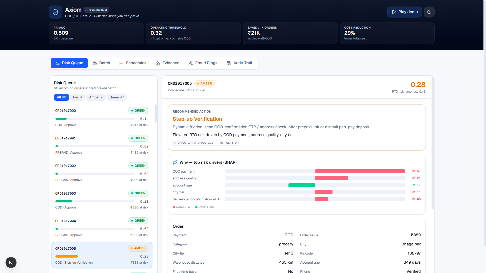
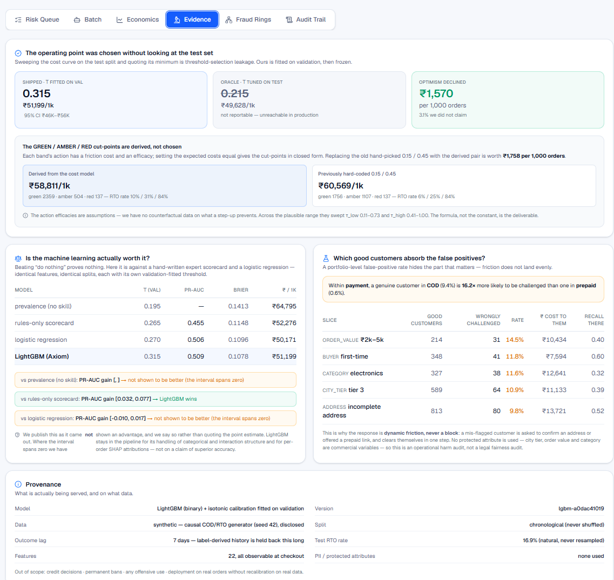
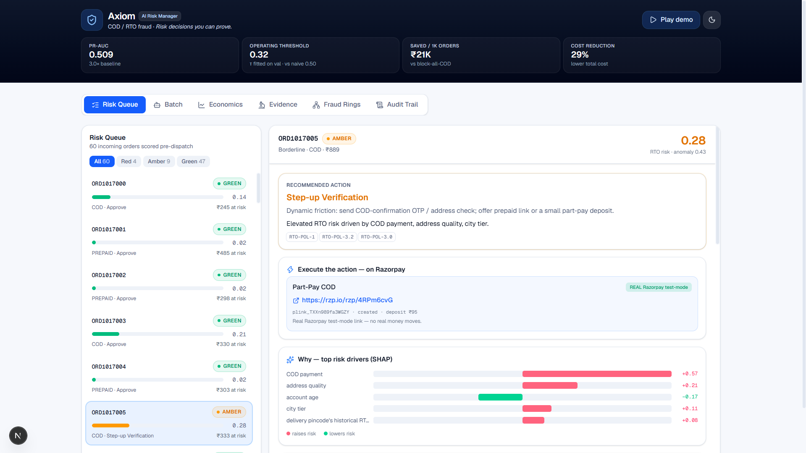
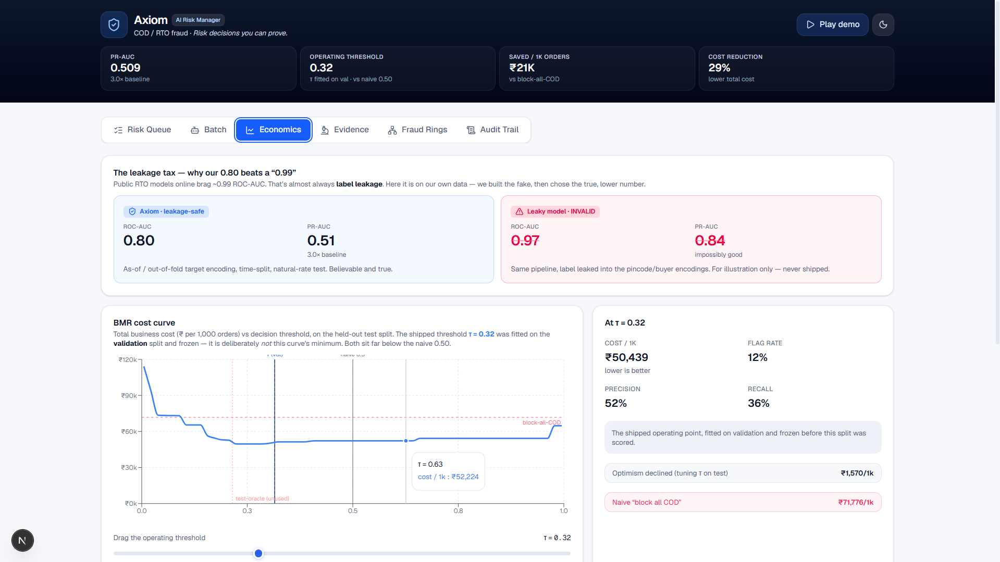
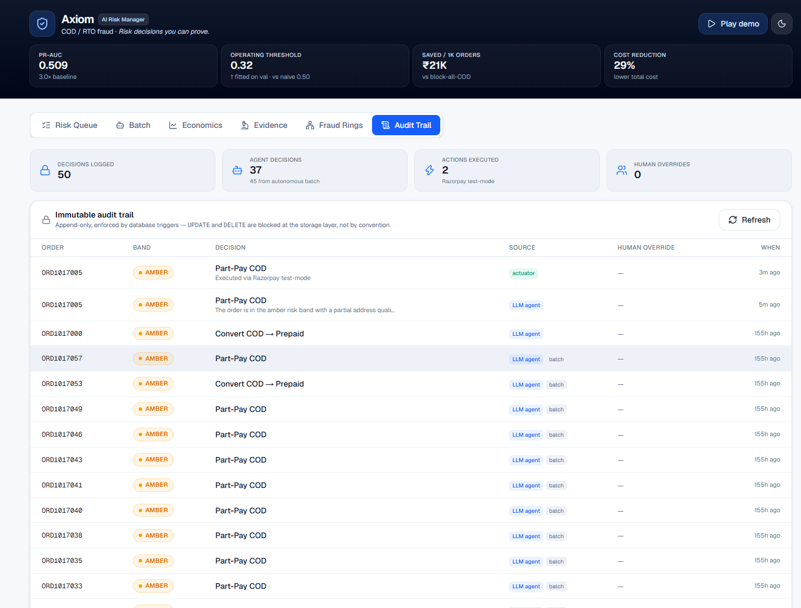

<!-- Line 1 = the problem. Line 2 = the demo. Line 3 = proof. (Judges & recruiters read this first.) -->
# 🛡️ Axiom — AI Risk Manager for COD / RTO Fraud

**Axiom scores every cash-on-delivery order for return-to-origin risk, explains the score, investigates borderline cases with a bounded agent, and executes a reversible, audited action chosen to minimise rupee cost — not a leaderboard number.**

<p>
<a href="https://github.com/HarshalAndhale9657/Axiom/actions/workflows/ci.yml"></a>


</p>

<!-- The CI badge is live: it rebuilds the dataset and model from a clean checkout, regenerates
     every published number, audits them for consistency, and runs the full test suite. A
     hand-typed "tests passing" badge would contradict the claim a few lines below it. -->

> 🎥 **Demo video:** _<add link — the 5-minute walkthrough>_ · 🔗 **Live console:** _<add link, or run it locally in two commands below>_



**Start here:** [the 60-second version](#the-60-second-version) · [honest metrics](#the-honest-metrics-claim-up-front) · [four things most submissions lack](#four-things-here-that-most-submissions-do-not-have) · [when it fails](#when-it-fails-on-purpose) · [architecture](#architecture) · [run it](#quickstart) · [rubric map](#the-track-2-bar-line-by-line)

---

### The 60-second version

> **Under our stated cost model, blocking every COD order costs a merchant more than blocking none** — ₹71,776 against ₹64,795 per 1,000 orders. That is not a measurement, it is arithmetic on an assumed friction cost, so we publish the break-even that would overturn it (₹123; we assume ₹138). Getting that trade-off right is the whole problem, and it is what Axiom is built to make provable.

| | held-out test split, scored once |
|---|---|
| Cheaper than blocking all COD | **₹20,578** per 1,000 orders _(95% CI ₹14,404–₹25,979)_ |
| PR-AUC | **0.509** _(95% CI 0.467–0.549)_ vs a 0.169 prevalence floor |
| Precision / recall at the shipped threshold | **0.543 / 0.335** — deliberately chosen, [priced against the alternatives](#the-recall-question-asked-before-you-do) |
| Optimism we declined to claim | **₹1,570** per 1,000 orders — the threshold is fitted on validation, never on test |

Three things that are unusual, and the reason to keep reading: the operating threshold is chosen **out-of-sample** and the gap is published; a **7-day outcome-availability lag** closes a leak most pipelines have; and the ablation **reports the comparison we lose**.

**Stack:** calibrated **LightGBM** + **SHAP** · a **bounded LLM agent** (typed tools, policy RAG, schema-constrained output) · **FastAPI** · **Next.js 16** console · immutable **SQLite** audit. Runs on a **$0 free tier**.

---

## The honest-metrics claim, up front

Track 2 is graded on *"honest metrics including false-positive cost."* Everything below was actually run, on a held-out split scored **once**, and is regenerated by a single command:

```bash
python -m src.model.full_report     # rewrites docs/evaluation.md, the figures and the JSON
```

**No number in this repository is typed by hand.** [`docs/evaluation.md`](docs/evaluation.md) is generated output; CI regenerates it and fails the build if it stops being internally consistent. [`tests/test_published_claims.py`](tests/test_published_claims.py) parses *this README* and asserts every figure in it against that JSON — if a retrain moves a number and the prose goes stale, the build goes red before a judge notices.

| | held-out test split (n = 3,000, never resampled) |
|---|---|
| **PR-AUC** | **0.509** (95% CI 0.467–0.549) vs a 0.169 prevalence baseline — **3.0×** |
| ROC-AUC | 0.800 (95% CI 0.780–0.821) |
| **Precision** @ the shipped threshold | **0.543** — of 313 orders flagged, 170 were genuine returns |
| **Recall** @ the shipped threshold | **0.335** — of 508 returns, 170 caught |
| Calibration (Brier) | 0.108 |

Confusion at the frozen threshold τ = 0.315: **TP 170 · FP 143 · FN 338 · TN 2,349**, a 10.4% flag rate. The 143 false positives are the number this whole project is organised around — [§ 4](#four-things-here-that-most-submissions-do-not-have) names which customers absorb them.

### The money story (₹ per 1,000 orders)

| policy | cost |
|---|---:|
| Approve everything | ₹64,795 |
| **Block all COD (naive)** | **₹71,776** ← *worse than doing nothing* |
| **Axiom @ the frozen threshold** | **₹51,199** |

**₹20,578 cheaper per 1,000 orders than blocking all COD** (95% CI ₹14,404–₹25,979) and **21% cheaper than approving everything.**

**And the middle row is a claim, so here is its break-even.** That blocking all COD costs more than doing nothing is not a measurement — it is arithmetic on an assumed friction cost, and it should be read as one. The policy would prevent **467** COD returns worth ₹179,693 while challenging **1,457** genuine COD customers, so it turns bad above **₹123** of cost per challenged customer. We assume **₹138** — only **1.12×** the break-even. Thin. Substitute your own number for what it costs to make a good customer prove themselves and the conclusion follows, or it does not; the dashboard slider exists for exactly that. Full working in [docs/evaluation.md §4](docs/evaluation.md).


| | |
|---|---|
|  |  |

> Accuracy is **intentionally never reported**. At a 17% RTO rate, flagging nothing scores 83% accuracy and prevents zero returns.

### The recall question, asked before you do

Catching a third of returns sounds low, so we priced the alternatives rather than defending the number:

| recall | precision | ₹ / 1k | vs shipped |
|---:|---:|---:|---:|
| 0.24 | 0.737 | ₹52,142 | +₹943 |
| **0.335 (shipped)** | **0.541** | **₹51,250** | — |
| 0.54 | 0.424 | ₹49,628 | **−₹1,570** |
| 0.67 | 0.356 | ₹52,952 | +₹1,753 |
| 0.79 | 0.313 | ₹56,913 | +₹5,714 |

Past roughly 0.65 the friction inflicted on good customers outruns the returns prevented. And note the honest wrinkle in row three: **recall 0.54 would have been ₹1,570 cheaper on this test split.** That is exactly the optimism gap we publish — validation put the threshold at 0.315, and taking the cheaper point requires having seen the test set, which is the one thing we will not do.

---

## Four things here that most submissions do not have

**1. The operating threshold was chosen without looking at the test set.**
Sweeping the cost curve on test and quoting its minimum is threshold-selection leakage — an oracle no production system can reach. Ours is fitted on **validation**, frozen into `models/thresholds.json` at train time, and the test split is scored once at that value. We also publish what the shortcut would have been worth: **₹1,570 per 1,000 orders (3.1%) of optimism we declined.**

**2. We found a second leak inside our own leakage-safe pipeline.**
"Use only the past" is not strict enough. An order placed today cannot know whether *yesterday's* order was returned — the delivery attempt has not resolved. Every label-derived history feature is therefore held back by a **7-day outcome-availability lag**. Cost of the correction: **0.0027 PR-AUC**, measured and published.

**3. We report the comparison we lose — and explain why we lose it.**
LightGBM beats a hand-written expert scorecard clearly (PR-AUC gain +0.032 to +0.077, paired bootstrap). Against a calibrated **logistic regression** the interval is **[−0.010, +0.017] — it spans zero, so we have not shown an advantage.**

The interesting part is *why*, and it is not a fact about RTO. Our generator composes risk **additively** — a sigmoid over a weighted sum, with no interaction terms anywhere — so logistic regression is the **correctly specified** model for this world and cannot be beaten by a tree ensemble except by luck. We measured that rather than asserting it: adding all **231** pairwise interactions to the logistic model changes test PR-AUC by **−0.038**. There is no non-additive structure to find. That is a limitation of our **synthetic data**, not a result about real order flow, where interactions plainly exist — a first-time buyer at a high-risk pincode is worse than the sum of those two facts. We keep LightGBM because it will find that structure when the data has it; on *this* dataset we cannot demonstrate the advantage, so we do not claim it.

| model | τ (val-fitted) | PR-AUC | Brier | ₹ / 1k |
|---|---:|---:|---:|---:|
| prevalence (no skill) | 0.195 | — | 0.1413 | ₹64,795 |
| rules-only scorecard | 0.265 | 0.455 | 0.1148 | ₹52,276 |
| logistic regression | 0.270 | 0.506 | 0.1096 | ₹50,171 |
| **LightGBM (Axiom)** | 0.315 | **0.509** | **0.1078** | ₹51,199 |

**4. We name the good customers who pay for our false positives.**
A portfolio-level FP rate hides the part that matters. `fp_rate_on_good` is the share of *genuine* customers in a slice put through friction:

| slice | good customers | wrongly challenged | rate |
|---|---:|---:|---:|
| order value ₹2k–5k | 214 | 31 | **14.5%** |
| first-time buyers | 348 | 41 | **11.8%** |
| tier-3 cities | 589 | 64 | **10.9%** |

A genuine tier-3 buyer is **3.8× more likely** to be challenged than a tier-1 buyer. This is exactly why the response is **dynamic friction, never a block** — a mis-flagged customer confirms an address or takes a prepaid link and clears themselves in one step. It uses no protected attribute; city tier, order value and category are commercial variables, so this is an operational harm audit, not a legal fairness audit.

*And the classic exhibit:* fitting the target encoders on all rows including their own label produces **ROC-AUC 0.966 / PR-AUC 0.841** — the sort of figure public RTO models advertise. We can manufacture it in one line and it is worthless. Toggle it live in the dashboard.

**All four exhibits are in the console, not just in this file:**



---

## When it fails, on purpose

*"Only showing the happy path"* is listed as a trap for this track, so here is the unhappy one. **Every failure below degrades to a bounded, audited, explainable decision — none of them can produce an unbounded action, and none of them can crash the request.**

| failure | what happens | where |
|---|---|---|
| Gemini free tier rate-limits or 5xx | `FallbackProvider` transparently fails over to OpenAI; the UI names the vendor that actually answered (`served_by`) | [`src/agent/llm.py:138`](src/agent/llm.py#L138) |
| Every provider is down, or there is no API key at all | The deterministic core decides. The whole product still runs end-to-end with **zero** LLM keys — reason codes become rule-derived text | [`src/agent/investigate.py:192`](src/agent/investigate.py#L192) |
| The LLM returns an action outside the closed set | Bound-checked against the enum and discarded before it can reach the actuator; deterministic fallback takes over | [`src/agent/investigate.py:184`](src/agent/investigate.py#L184) |
| The LLM returns malformed JSON | Caught with the parse/type errors; same deterministic fallback | [`src/agent/investigate.py:192`](src/agent/investigate.py#L192) |
| The cross-vendor verifier vetoes the recommendation | The case escalates to a human instead of executing | [`src/agent/verify.py`](src/agent/verify.py) |
| A fail-over makes "cross-vendor" verification single-vendor | Detected, and the independence claim is dropped rather than quietly overstated | [`src/agent/investigate.py:132`](src/agent/investigate.py#L132) |
| A batch would run too long, cost too much, or spam customers | Genuine stopping rules fire — max-N, LLM call budget, consecutive-low-value cutoff, quiet hours | [`src/agent/batch.py:79`](src/agent/batch.py#L79) |

Eleven tests cover these paths specifically ([`tests/test_agent.py`](tests/test_agent.py), [`test_llm.py`](tests/test_llm.py), [`test_verify.py`](tests/test_verify.py)) — the fallbacks are asserted behaviour, not aspiration.

### Scale, not an anecdote

One lucky case proves nothing, so the agent runs the whole amber queue autonomously. A real run, on the labelled held-out batch:

```
processed 30 · RTOs caught 12 · good customers frictioned 18 · net recovered ₹1,910
stopped: reached LLM call budget (30)
```

Two things worth noticing. The run **stopped on its own budget rule** rather than working the queue to exhaustion — that is the guardrail firing, and it is the intended outcome. And we report that catching 12 returns cost 18 genuine customers a verification step; that ratio is the false-positive cost the track asks about, stated where it is least flattering.

---

## Razorpay already grades COD risk. So what is this?

Magic Checkout already *"nudges high-risk shoppers to prepay"*, *"charges differential COD fees for medium-risk orders"* and *"disables COD for high-risk users with a history of failed deliveries"* ([razorpay.com/magic-checkout](https://razorpay.com/magic-checkout/)). The graded response in this repo is not a new idea — it is the idea Razorpay shipped, and any submission that frames a binary COD block as the state of the art has not used the product.

What Axiom adds is the layer underneath that decision: the **evidence** for which grade is right and what being wrong costs, in rupees. A threshold fitted out-of-sample with the optimism published. A break-even for every cost assumption, so a reader can substitute their own. The per-slice bill that genuine customers pay for our false positives. An immutable trail that makes each decision defensible weeks later. The "block all COD" row in the table above is a reference point for the arithmetic, not a description of how anyone serious operates.

---

## Architecture


**Four layers, one bounded path** (mirroring Razorpay's own Bumblebee / RTO-Shield design):

1. **Detector** — calibrated LightGBM → per-order P(RTO) + **SHAP** attributions; an **IsolationForest** adds an unsupervised trip-wire for cold-start and zero-day patterns.
2. **Decision core** — **deterministic rules run *before* the LLM** (highest precision, fully explainable), then the score is banded GREEN / AMBER / RED at cut-points **derived in closed form from the action economics**, not hand-picked. Each band's action has a friction cost and an efficacy; setting the expected costs equal gives the thresholds. Removing the old magic numbers is worth **₹1,758 per 1,000 orders**.
3. **Response** — GREEN/RED get an instant bounded action; **only AMBER** reaches the agent, which runs typed tools, retrieves policy via RAG, and emits a **schema-constrained** decision from a closed action set it cannot step outside. A second, **cross-vendor** model (OpenAI checking Gemini) can veto it; a veto escalates to a human.
4. **HITL + immutable audit** — every decision and human override lands in an append-only store, enforced by database triggers.

*Cross-cutting:* reason codes are **grounded** — the LLM narrates only the SHAP factors and retrieved policy it is handed, and **never** changes a score or invents an action.

Design decisions and the alternatives rejected are logged in [`docs/project/DECISIONS.md`](docs/project/DECISIONS.md); the deeper write-up is [`docs/architecture.md`](docs/architecture.md).

---

## What it does (all three Track-2 modalities)

The brief asks for *"detectors, verifiers, or auto-responders."* Axiom ships all three.

- **Detector** — calibrated RTO risk score + SHAP driver bars.
- **Verifier** — address-quality / pincode-serviceability checks that can *downgrade* risk on verification; plus a cross-vendor adversarial verifier over the agent's own recommendation.
- **Auto-responder** — a bounded, tiered **dynamic-friction** engine: `green → frictionless` · `amber → step-up / part-pay / COD→prepaid` · `red → hold / escalate`. Executing a convert-or-part-pay action creates a **real Razorpay test-mode payment link**. A mis-flagged good customer is *verified*, never silently banned.
- **Autonomous batch mode** — works the whole amber queue under real stopping rules and reports honest net-₹ economics on the labelled held-out batch.
- **Grounded analyst copilot** — read-only Q&A that answers *only* from the case record and cites the policy it used, and says "that isn't in the case record" when asked anything else.



The `rzp.io` link above is live test-mode output from the Razorpay API, not a mock. No real money moves.

---

## Quickstart

**Prerequisites:** Python 3.10+, Node 20.9+ (required by Next 16). A free **Gemini** key is optional — the agent and reason codes fall back to deterministic output without one, and everything still runs.

```bash
# 1) Backend
pip install -r requirements.txt
python -m src.data.generate_synthetic_cod --n 20000 --seed 42   # reproducible seed data
python -m src.model.train                                       # train, calibrate, freeze τ on val
cp .env.example .env                                            # (optional) add GEMINI_API_KEY
uvicorn src.api.main:app --reload                               # API → http://127.0.0.1:8000

# 2) Dashboard (new terminal)
npm --prefix web install
npm --prefix web run dev                                        # console → http://localhost:3000
```

`make help` lists the shortcuts: `make setup` · `make data` · `make train` · `make report` · `make test` · `make api` · `make web` · `make docker`.

**`make verify` rebuilds the dataset, the model, the tests and every published number from source** — the one command that proves nothing here is stale.

**Docker:** `docker build -t axiom . && docker run --rm -p 8000:8000 axiom`. The image generates the data and trains the model *at build time* from the seeded generator, so what ships is not a pickle you have to trust.

A free Gemini key: [aistudio.google.com](https://aistudio.google.com) → *Get API key* (Google account, no card). Then `GEMINI_API_KEY=...` in `.env`.

---

## The dashboard

A production-grade risk console (light + **dark** mode) — **click "Play demo"** for a hands-free walkthrough.

- **Risk Queue** — filterable, banded, rupee-at-risk per order.
- **Case detail** — SHAP driver bars → live agent trace (tool evidence, policy citations, cross-vendor verdict) → grounded copilot → human override.
- **Batch** — autonomous amber sweep with stopping rules and net-₹ economics.
- **Economics** — the interactive BMR cost curve (with the frozen τ *and* the unused test-oracle τ marked), a ₹ confusion matrix at any threshold, the live decision-flow pipeline, and the leaky-vs-honest toggle.
- **Evidence** — the four exhibits above: frozen-vs-oracle threshold, derived band economics, the baseline ablation with its intervals, and the failure-mode matrix.
- **Fraud Rings** — an interactive shared-device graph found **without any label access**, validated honestly against the hidden ring flag.
- **Audit Trail** — the immutable log, with each decision's source and any human override.

| | |
|---|---|
|  |  |
| **Economics** — the cost curve carries the frozen τ *and* the test-oracle τ we did not use. Above it, the leakage exhibit: our honest 0.80 beside the 0.97 we could have advertised. | **Audit trail** — append-only, enforced by database triggers. Every row names its source, so an agent decision and an autonomous batch decision are never confused. |

---

## The Track-2 bar, line by line

> *"Develop detectors, verifiers, or auto-responders for fraud, returns, or chargebacks, with measured precision/recall."*
> *"Honest metrics including false-positive cost. Strictly defense-only: anything offense-capable is disqualified."*

| Requirement | How Axiom satisfies it |
|---|---|
| Detector · verifier · auto-responder | All three present, demonstrable, and executing real test-mode actions |
| Measured precision / recall | **0.543 / 0.335** at a frozen threshold, with bootstrap intervals, on an untouched time-split test set — plus the recall curve priced in rupees |
| **Honest metrics incl. false-positive cost** | Rupee BMR cost curve, threshold fitted out-of-sample with the optimism gap published, per-slice false-positive burden on good customers, baseline ablation including the comparison we lose, two leakage taxes paid and measured |
| No cherry-picking | Every published number is regenerated by one command and unit-tested against this README in CI |
| Failure modes shown, not hidden | A [dedicated section](#when-it-fails-on-purpose) of degradation paths, each one tested |
| Scale over anecdote | Autonomous batch over the full amber queue, stopping rules firing, net-₹ reported honestly |
| **Strictly defense-only** | Scores / flags / verifies / protects only — every action reversible, nothing offense-capable |
| Meaningful AI | Bounded agent (typed tools + policy RAG + schema-constrained decisions), cross-vendor adversarial verifier, grounded SHAP→LLM reason codes |
| Auditable & bounded | Rules-before-LLM, closed action set, DB-enforced immutable audit, human override on every path |

---

## Tech stack
Python · **LightGBM** + **IsolationForest** · **SHAP** · **FastAPI** · **SQLite** (immutable audit) · provider-agnostic LLM on **Gemini** free tier with OpenAI fail-over · TF-IDF policy RAG · **NetworkX** ring detection · **Next.js 16** + Tailwind + Recharts.

Dependencies are deliberately minimal — every package in `requirements.txt` is actually imported, and a test enforces it. The LLM layer speaks HTTPS directly, so no vendor SDK is required; the policy retriever is TF-IDF over a small corpus, so no vector database is required.

## Testing
`pytest -q` → **178 tests**, including the leakage guards (first-sighting encoding == prior, outcome-lag monotonicity, velocity independence), a hand-checked rupee cost example, the frozen-threshold-never-beats-the-oracle invariant, paired-bootstrap determinism, closed-action-space checks, the agent's degradation paths, and API/audit round-trips. CI additionally rebuilds the dataset and model from scratch and re-audits every published number.

## Repo map
`src/` — `data` · `features` · `model` · `rules` · `agent` · `rag` · `graph` · `actions` · `audit` · `api` · `web/` — the dashboard · `docs/` — plan, policy, evaluation, figures · `notebooks/` — the runnable evaluation.
See **[PLAN.md](PLAN.md)** for the strategy, **[MODEL_CARD.md](MODEL_CARD.md)** for intended use and limitations, and **[docs/evaluation.md](docs/evaluation.md)** for the full evidence pack.

## Defense-only & honesty
Axiom is **strictly defensive** and contains nothing offense-capable. Every metric here was actually run. The stated limitations, in full, are in [MODEL_CARD.md](MODEL_CARD.md) — the headline ones: the dataset is **synthetic** (no clean public Indian COD/RTO data exists, so orders are drawn from an explicit causal model of the published drivers, and the pipeline is built to run identically on real orders after recalibration); the cost model and the action efficacies are **stated assumptions**, swept rather than asserted; and LightGBM is **not** shown to beat logistic regression on this data.

## License
[MIT](LICENSE) · © 2026 Harshal Andhale
