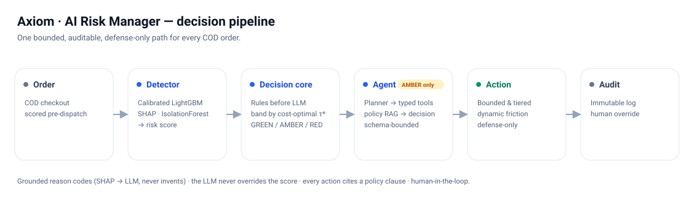
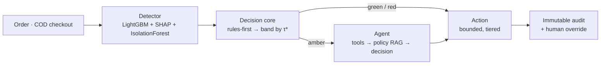

# Architecture

Full narrative in [PLAN.md §5](../PLAN.md). Summary of the four layers:

1. **Detector** — calibrated LightGBM → risk score + SHAP; IsolationForest anomaly trip-wire alongside.
2. **Decision core** — deterministic rules run **first** (Razorpay-Bumblebee pattern), then band by cost-optimal thresholds (GREEN / AMBER / RED).
3. **Response** — auto-responder for green/red; a **bounded LLM agent** investigates AMBER only (planner → typed tools → policy RAG → schema-constrained decision).
4. **HITL + immutable audit trail** — every decision logged (append-only, DB-enforced); a human can override, and the override is logged with before/after.

**Cross-cutting — grounded explanation:** SHAP factors + retrieved policy → the LLM narrates *only* those (never invents), and never overrides the score.

## Mermaid (maintainable source)

## Real-time note
Feature computation is designed to run **identically offline and online** (as-of / past-only), so the same code that trains also scores at checkout — no train/serve skew. In production this sits behind a streaming feature store (narrated, not built for the demo).
