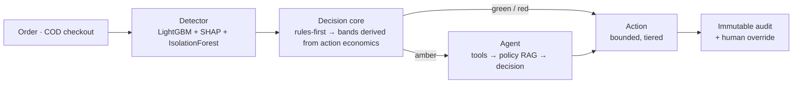

# Architecture

Full narrative in [PLAN.md §5](../PLAN.md). Summary of the four layers:

1. **Detector** — calibrated LightGBM → risk score + SHAP; IsolationForest anomaly trip-wire alongside.
2. **Decision core** — deterministic rules run **first** (Razorpay-Bumblebee pattern), then band GREEN / AMBER / RED at cut-points **derived in closed form** from each action's friction cost and efficacy (`src/model/threshold.py`), not hand-picked. The binary operating threshold is fitted on the **validation** split and frozen into `models/thresholds.json` at train time; the test split is scored once at that value.
3. **Response** — auto-responder for green/red; a **bounded LLM agent** investigates AMBER only (planner → typed tools → policy RAG → schema-constrained decision).
4. **HITL + immutable audit trail** — every decision logged (append-only, DB-enforced); a human can override, and the override is logged with before/after.

**Cross-cutting — grounded explanation:** SHAP factors + retrieved policy → the LLM narrates *only* those (never invents), and never overrides the score.

## Mermaid (maintainable source)

## Evidence layer

Serving is only half the system; the other half is being able to prove the numbers.

- `src/model/threshold.py` — the frozen operating point (fitted on val), the closed-form band cut-points, and the sensitivity sweep over the assumptions behind them.
- `src/model/evaluation.py` — the rupee cost curve, bootstrap intervals, and the **optimism gap** against the test-optimal oracle we deliberately do not use.
- `src/model/baselines.py` — the ablation ladder (expert scorecard, logistic regression, LightGBM) with paired bootstrap intervals on each gap.
- `src/model/slices.py` — the failure-mode matrix: which genuine customers absorb the false positives, and what it costs them.
- `src/model/full_report.py` — one command that regenerates [evaluation.md](evaluation.md), the figures and `reports/evaluation.json`, and (`--check`) audits the result. Nothing published is hand-typed.

Exposed to the dashboard as `GET /thresholds`, `/baselines`, `/slices`, `/model_meta`, and rendered in the **Evidence** tab.

## Real-time note
Feature computation is designed to run **identically offline and online** (as-of / past-only, and only over outcomes that have actually resolved — see the 7-day outcome-availability lag), so the same code that trains also scores at checkout — no train/serve skew and no dependency on knowledge a live scorer would not have. In production this sits behind a streaming feature store (narrated, not built for the demo).
